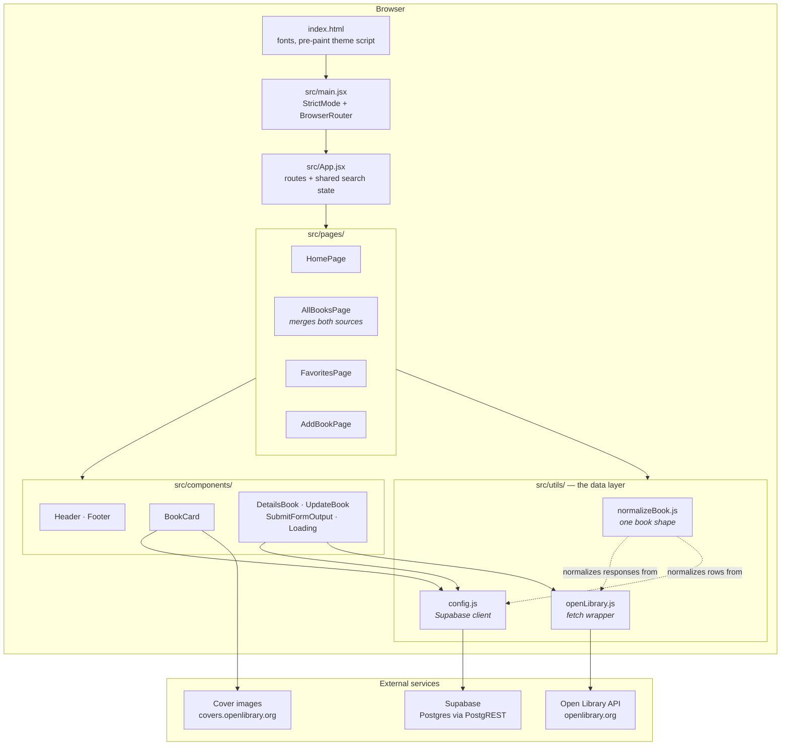
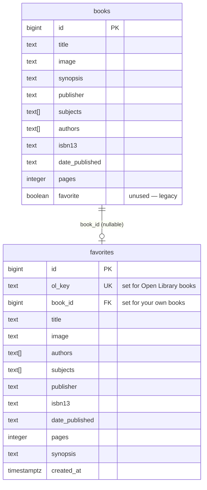
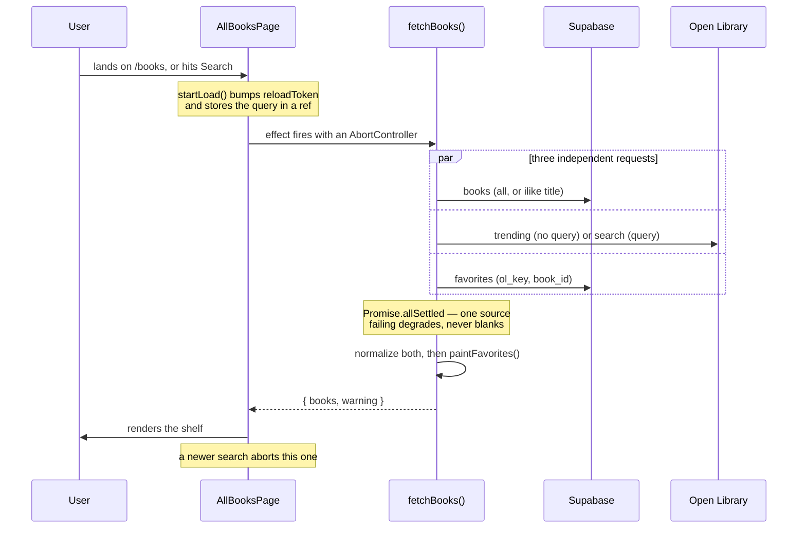
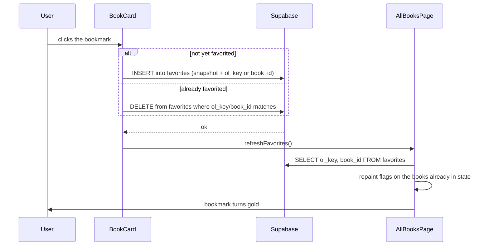

# Architecture

How Wordsmith Retreat fits together, for someone reading the code for the first time.

Statements marked **(inferred)** are conclusions drawn from reading the code rather
than from documentation the authors left behind. Everything else is directly
observable in the source.

---

## 1. The one idea that explains everything

The app shows books from **two sources at once**, on one shelf:

| Source                                    | Provides                                                                 | Writable?                           |
| ----------------------------------------- | ------------------------------------------------------------------------ | ----------------------------------- |
| **Open Library** — a public REST API      | Browsing (weekly trending) and title search across a huge public catalog | **No.** It has no public write API. |
| **Supabase** — a hosted Postgres database | The user's own books, and their bookmarks                                | **Yes.**                            |

Almost every design decision in this codebase follows from that asymmetry. You
can _read_ millions of books but only _write_ to your own small corner, so the
code keeps two shapes of data and merges them at the last moment.

The merge happens in `src/pages/AllBooksPage.jsx`, and the translation that makes
it possible lives in `src/utils/normalizeBook.js`.

---

## 2. Layers



There is **no backend of our own**. The browser talks straight to Supabase and
straight to Open Library. `vercel.json` only rewrites all paths to `index.html`
so client-side routing works on a static host.

### What lives where

| Path              | Responsibility                                                                 |
| ----------------- | ------------------------------------------------------------------------------ |
| `src/main.jsx`    | Entry point. Mounts React, wraps the app in `StrictMode` and `BrowserRouter`.  |
| `src/App.jsx`     | Declares the four routes and owns the two pieces of state shared across pages. |
| `src/pages/`      | One component per route. Pages own data fetching and page-level state.         |
| `src/components/` | Reusable UI. Components receive data and callbacks as props.                   |
| `src/utils/`      | The data layer: API clients and the normalization that unifies them.           |
| `src/styles/`     | All CSS. `tokens.css` holds the design system; the rest is per page/component. |
| `src/assets/`     | Images (logo, social icons).                                                   |

---

## 3. The book shape

Both sources are translated into **one object shape** before any component sees
them. This is the most important contract in the codebase — every component
below the data layer assumes it.

```js
{
  source: "openlibrary" | "supabase",  // which source this came from
  id,                                   // "/works/OL27448W" (string) or 42 (number)
  title, image, authors[], subjects[],
  publisher, isbn13, date_published, pages, synopsis,
  favorite,                             // painted on during the merge, not stored on the book
}
```

`source` is not decoration. It decides real behavior:

- **Which writes are allowed.** `DetailsBook` only renders Update and Delete when
  `source === "supabase"`, because Open Library cannot be edited.
- **How a bookmark is stored.** A catalog book is bookmarked by its Open Library
  key; one of your own books by its database id.
- **React keys.** The two sources use different id _types_ (string vs number), so
  `bookKey()` produces `"source:id"` to guarantee uniqueness across a merged list.

The translators are `fromOpenLibrary()`, `fromSupabase()`, and `fromFavorite()`
in `src/utils/normalizeBook.js`.

---

## 4. Data model



Two things about `favorites` are worth understanding before you touch it:

**Exactly one of `ol_key` / `book_id` is set.** A database `CHECK` constraint
(`num_nonnulls(ol_key, book_id) = 1`) enforces it. That column is what tells the
app which source a bookmark points back at, and `fromFavorite()` reads it to
reconstruct `source`.

**The other columns are a snapshot, not a join.** When you bookmark a catalog
book, its title, cover and metadata are _copied_ into the row. This is deliberate:
Open Library is rate limited to roughly **1 request per second** for browsers, so
rendering a favorites page by re-fetching each bookmarked work would take one
second per book. The cost is that editing one of your own books does not rewrite
an existing bookmark's snapshot.

`books.favorite` is a leftover column from before bookmarks moved into their own
table. Nothing reads or writes it any more.

---

## 5. Lifecycle of an interaction

### Browsing or searching `/books`

This is the most involved path in the app.



Details that are easy to miss:

1. **`reloadToken`, not the query, drives the effect.** The query lives in a ref.
   That way re-running the _same_ search still refetches, which a `[query]`
   dependency array would skip.
2. **`Promise.allSettled`, not `Promise.all`.** The sources are independent, so
   Supabase being down still shows catalog results, with a notice explaining what
   is missing.
3. **Supabase does not throw on errors.** It resolves to `{ data, error }`. Both
   that and a genuine rejection have to be unwrapped — see `readOwned()`.
4. **Search is debounced (400 ms) and aborted.** Open Library's browser rate limit
   is ~1 req/s, so rapid submits are coalesced and superseded requests cancelled.
5. **Favorites are painted on, not stored.** `favoriteIndex()` builds two Sets
   (one of `ol_key`s, one of `book_id`s) and `paintFavorites()` stamps the flag
   onto whichever books match.

### Bookmarking a book



`refreshFavorites()` deliberately re-queries **only** the favorites table. An
earlier version reloaded all three sources, including a ~2 second Open Library
call that could not have changed, which made a bookmark take 5–6 seconds to
appear. It now takes roughly 400 ms.

### Adding a book

`AddBookPage` validates locally, checks Supabase for a title collision, inserts,
then shows `SubmitFormOutput`. Its "Finish" button navigates to `/books` **and
sets the shared `searchString` to the new title** — which is why the `/books`
search has to query Supabase as well as Open Library, or a freshly added book
would appear to vanish.

---

## 6. State management

There is no state library. State lives in three places:

- **`App.jsx`** holds `searchString` (shared between the home page, the books page
  and the add-book flow) and `activePage` (which nav item to highlight). Both are
  prop-drilled down.
- **Pages** own their own data, loading, and error state.
- **The URL** holds the current route, via React Router.

**(inferred)** `activePage` predates a cleaner option: every page calls
`setActivePage(...)` from an effect purely so the header can highlight a nav item,
which React Router's `NavLink` does natively. It works, it is just more machinery
than the job needs.

---

## 7. Styling

All CSS is hand-written; there is no framework or CSS-in-JS.

`src/styles/tokens.css` defines the design system as CSS custom properties —
colour, type scale, spacing, radius, motion. **Every colour in the app resolves
through a token**; no other stylesheet contains a hard-coded hex value.

Theming works in three states:

1. No `data-theme` attribute → follow the OS via `prefers-color-scheme`.
2. `data-theme="dark"` / `"light"` on `<html>` → an explicit choice wins.
3. An inline script in `index.html` applies the stored choice _before_ React
   mounts, so an explicit theme never flashes the wrong one on load.

Only the semantic layer (`--bg`, `--text`, `--accent`, …) is redefined per theme;
the raw primitives never move.

---

## 8. Key design decisions

| Decision                                          | Why                                                                                      | Where                     |
| ------------------------------------------------- | ---------------------------------------------------------------------------------------- | ------------------------- |
| Two sources merged client-side                    | Open Library is read-only, so writes need somewhere else to live                         | `AllBooksPage.jsx`        |
| One normalized book shape with a `source` tag     | Lets every component stay ignorant of where a book came from                             | `normalizeBook.js`        |
| Favorites in their own table, snapshotted         | One query renders the page instead of one API call per bookmark, against a 1 req/s limit | the schema in `README.md` |
| `allSettled` over `all`                           | One source failing should degrade the shelf, not empty it                                | `fetchBooks()`            |
| Debounce + `AbortController`                      | Respects the rate limit and stops a slow response overwriting a newer one                | `AllBooksPage.jsx`        |
| Native `fetch` for Open Library                   | No auth or interceptors needed, so no HTTP client dependency                             | `openLibrary.js`          |
| **(inferred)** Client-generated ids for new books | `Math.random()` suggests the `books.id` column has no usable default                     | `AddBookPage.jsx`         |

---

## 9. Where do I look if I want to change…

| I want to…                                        | Start here                                                                       |
| ------------------------------------------------- | -------------------------------------------------------------------------------- |
| Change what the unsearched `/books` page shows    | `getTrending()` in `src/utils/openLibrary.js`                                    |
| Change how search matches titles                  | `searchBooks()` — it uses Open Library's `title=` parameter                      |
| Request more fields from Open Library             | The `FIELDS` constant in `src/utils/openLibrary.js`                              |
| Change how a book's data is shaped                | `src/utils/normalizeBook.js` — everything downstream depends on it               |
| Change how the two sources are merged or ordered  | `fetchBooks()` in `src/pages/AllBooksPage.jsx`                                   |
| Change bookmark behavior                          | `addFavorite` / `removeFavorite` in `src/components/BookCard.jsx`                |
| Change the favorites page                         | `src/pages/FavoritesPage.jsx`                                                    |
| Change what the details panel shows               | `src/components/DetailsBook.jsx`                                                 |
| Change add-book validation or duplicate detection | `missingFields()` and `handleSubmit()` in `src/pages/AddBookPage.jsx`            |
| Change colours, type, or spacing                  | `src/styles/tokens.css` — do **not** hard-code values elsewhere                  |
| Change the shelf's look or the hover animation    | `src/styles/pages/AllBooksPage.css`                                              |
| Change the navigation or theme toggle             | `src/components/Header.jsx`                                                      |
| Change the database schema                        | Run SQL in the Supabase dashboard, then update the schema section of `README.md` |
| Change lint rules                                 | `eslint.config.js` (flat config, ESLint 10)                                      |

---

## 10. Things to know before your first change

- **React `StrictMode` double-invokes effects in development.** You will see every
  fetch fire twice, with the first aborted. That is expected and does not happen
  in production builds.
- **`react-hooks/set-state-in-effect` is enforced.** The linter rejects calling
  setState synchronously from an effect, _including_ through a helper function
  defined in component scope. The codebase works around this by keeping fetch
  helpers at module scope (no setState inside) and setting state in a `.then()`.
  If you get this error, that is the pattern to follow.
- **Open Library is rate limited** to about 1 request per second from a browser.
  The higher tier needs a custom `User-Agent`, which browsers forbid setting.
- **Supabase resolves errors, it does not throw.** Always check `{ error }`.
- **The Supabase policies are permissive.** The publishable key ships in the
  client bundle, so anyone holding it can write to these tables. Fine for a demo,
  not for real data.
